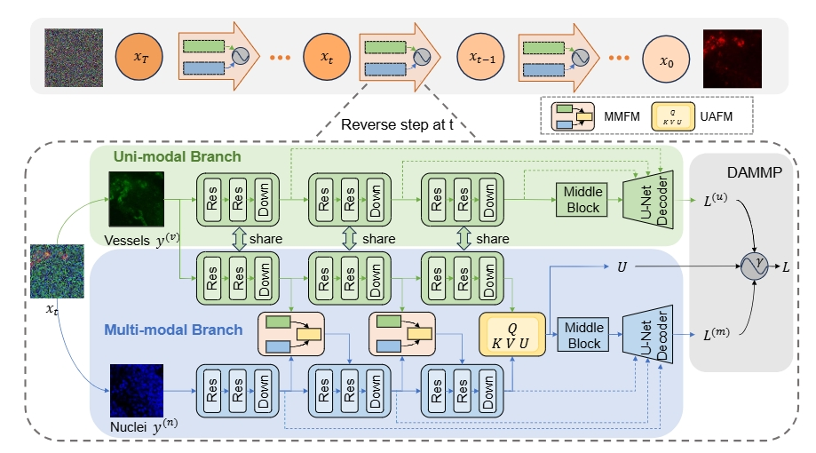

# DAMM-Diffusion
<details>
<summary>
  <b>DAMM-Diffusion: Learning Divergence-Aware Multi-Modal Diffusion Model for Nanoparticles Distribution Prediction</b>, CVPR 2025.
  <!-- <a href="https://arxiv.org/abs/2306.08330" target="blank">[arxiv]</a>
  <a href="https://openaccess.thecvf.com/content/ICCV2023/papers/Xu_Multimodal_Optimal_Transport-based_Co-Attention_Transformer_with_Global_Structure_Consistency_for_ICCV_2023_paper.pdf" target="blank">[paper]</a> -->
  <br><em>Junjie Zhou, Shouju Wang, Yuxia Tang, Qi Zhu, Daoqiang Zhang, WEI SHAO</em></br>
</summary>

</details>



**Summary:** Here is the official implementation of the paper "DAMM-Diffusion: Learning Divergence-Aware Multi-Modal Diffusion Model for Nanoparticles Distribution Prediction".

## Table of Contents
- [Introduction](#introduction)
- [Data preparation](#data-preparation)
- [Requirements](#requirements)
- [Usage](#Usage)
- [Acknowledgement](#acknowledgement)

## Introduction

  The prediction of nanoparticles (NPs) distribution is crucial for the diagnosis and treatment of tumors. Recent studies indicate that the heterogeneity of tumor microenvironment (TME) highly affects the distribution of NPs across tumors. Hence, it has become a research hotspot to generate the NPs distribution by the aid of multi-modal TME components. However, the distribution divergence among multi-modal TME components may cause side effects i.e., the best uni-modal model may outperform the joint generative model. To address the above issues, we propose a Divergence-Aware Multi-Modal Diffusion model (i.e., DAMM-Diffusion) to adaptively generate the prediction results from uni-modal and multi-modal branches in a unified network. In detail, the uni-modal branch is composed of the U-Net architecture while the multi-modal branch extends it by introducing two novel fusion modules i.e., Multi-Modal Fusion Module (MMFM) and Uncertainty-Aware Fusion Module (UAFM). Specifically, the MMFM is proposed to fuse features from multiple modalities, while the UAFM module is introduced to learn the uncertainty map for cross-attention computation. Following the individual prediction results from each branch, the Divergence-Aware Multi-Modal Predictor (DAMMP) module is proposed to assess the consistency of multi-modal data with the uncertainty map, which determines whether the final prediction results come from  multi-modal or uni-modal predictions. We predict the NPs distribution given the TME components of tumor vessels and cell nuclei, and the experimental results show that DAMM-Diffusion can generate the distribution of NPs with higher accuracy than the comparing methods. Additional results on the multi-modal brain image synthesis task further validate the effectiveness of the proposed method.

## Data preparation 
The final structure of paired datasets should be as following:
```
DATA_ROOT_DIR/
    └──DAPI_DIR/
        ├── 00001.jpg
        ├── 00002.jpg
        └── ...
    └──VESSELS_DIR
        ├── 00001.jpg
        ├── 00002.jpg
        └── ...
    └──NUCLEI_DIR
        ├── 00001.jpg
        ├── 00002.jpg
        └── ...
```

## Requirements

1. Create conda environment.
```
conda create -n robust python=3.9
conda activate robust
```
2. Install the required packages.
```
pip install -r requirements.txt
```
3. Check the installed packages.
```
conda list
```

## Usage
Experiments can be run using the following steps:

1. train the latent embedder
```bash
python train_latent_embedder.py --data_name <DATA_NAME> --path_root <PATH_ROOT> --img_size <IMG_SIZE> --batchsize <BATCHSIZE> 
```

2. train the diffusion model
```bash
python train_diffusion.py --data_name <DATA_NAME> --path_root <PATH_ROOT> --img_size <IMG_SIZE> --batchsize <BATCHSIZE> --ckp_dapi <CKP_DAPI> --ckp_vessels <CKP_VESSELS> --ckp_nuclei <CKP_NUCLEI>
```

## Acknowledgement
We would like to thank the following repositories for their great works:
- [medfusion](https://github.com/mueller-franzes/medfusion)

<!-- ## License & Citation
This project is licensed under the Apache-2.0 License.

If you find this work useful, please cite our paper:
```
@inproceedings{zhang2023prototypical,
  title={Prototypical Information Bottlenecking and Disentangling for Multimodal Cancer Survival Prediction},
  author={Zhang, Yilan and Xu, Yingxue and Chen, Jianqi and Xie, Fengying and Chen, Hao},
  booktitle={The Twelfth International Conference on Learning Representations},
  year={2024}
}
``` -->